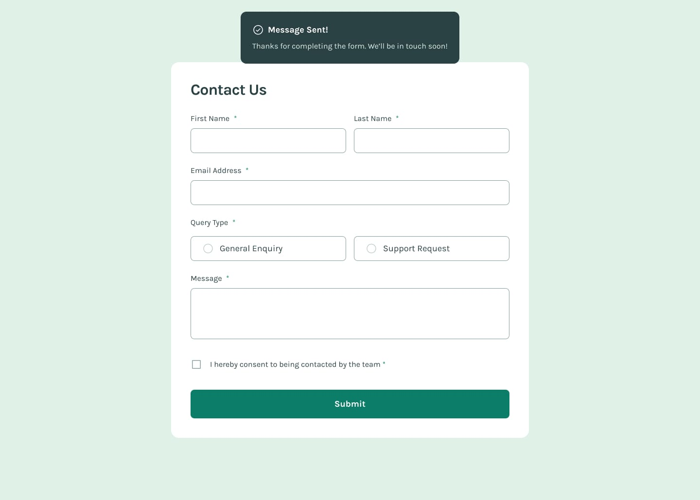

# Frontend Mentor - Contact Form Solution

This is a solution to the [Contact Form Challenge on Frontend Mentor](https://www.frontendmentor.io/challenges/contact-form--G-hYlqKJj). This challenge helps improve coding skills by working on realistic projects.

## Table of Contents

- [Overview](#overview)
  - [The Challenge](#the-challenge)
  - [Screenshot](#screenshot)
  - [Links](#links)
- [My Process](#my-process)
  - [Built With](#built-with)
  - [What I Learned](#what-i-learned)
- [Author](#author)
- [Acknowledgments](#acknowledgments)

## Overview

### The Challenge

Users should be able to:

- Complete the form and see a success message upon submission.
- Receive form validation messages if:
  - A required field is missing.
  - The email address is not formatted correctly.
- Navigate the form using only a keyboard.
- Have inputs, error messages, and the success message accessible via screen readers.
- View an optimal layout depending on screen size.
- See hover and focus states for all interactive elements.

### Screenshot




### Links

- [Solution URL](https://your-solution-url.com)
- [Live Site URL](https://your-live-site-url.com)

## My Process

### Built With

- Semantic HTML5 markup
- CSS custom properties
- Flexbox
- Mobile-first workflow
- [React](https://reactjs.org/) - JavaScript library
- [TailwindCSS](https://Tailwindcss.org/) - Css Framework

### What I Learned

This project helped reinforce:

- Form validation in React.
- Managing form state using the `useState` hook.
- Accessibility considerations in form design.
- Improving UX with error handling and success messages.

```js
const handleChange = (e) => {
  const { name, value, type, checked } = e.target;
  setFormData({
    ...formData,
    [name]: type === "checkbox" ? checked : value,
  });
};
```

## Author

- Frontend Mentor - [@gauravk2203](https://www.frontendmentor.io/profile/gauravk2203)

## Acknowledgments

Special thanks to the Frontend Mentor community for their support and feedback!