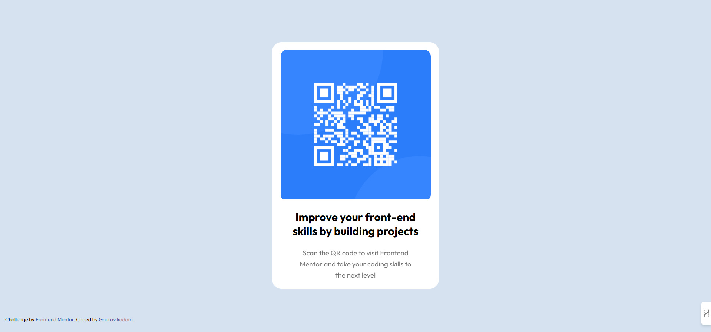
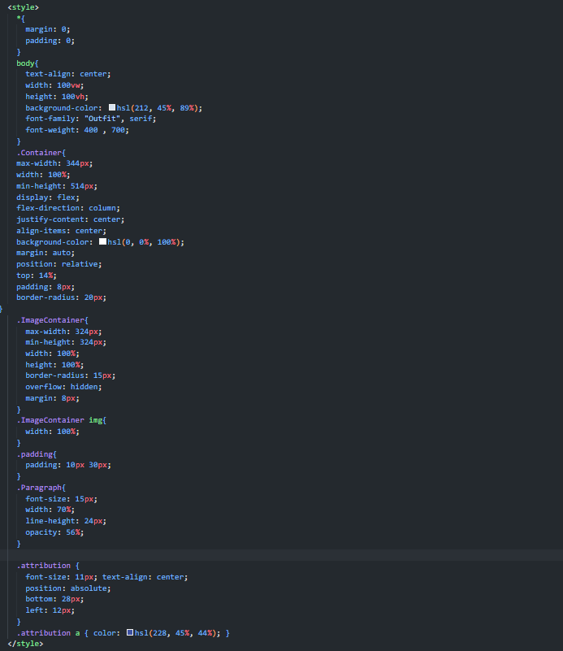

# Frontend Mentor - QR Code Component Solution

This is a solution to the [QR code component challenge on Frontend Mentor](https://www.frontendmentor.io/challenges/qr-code-component-iux_sIO_H). Frontend Mentor challenges help you improve your coding skills by building realistic projects. 

## Table of Contents

- [Overview](#overview)
  - [Screenshot](#screenshot)
  - [Links](#links)
- [My Process](#my-process)
  - [Built With](#built-with)
  - [What I Learned](#what-i-learned)
  - [Continued Development](#continued-development)
  - [Useful Resources](#useful-resources)
- [Author](#author)
- [Acknowledgments](#acknowledgments)

## Overview

### Screenshot

### Links

- Solution URL: [View my solution](https://www.frontendmentor.io/challenges/qr-code-component-iux_sIO_H/solutions)
- Live Site URL: [Visit live site](https://your-live-site-url.com)

## My Process

### Built With

- Semantic HTML5 markup
- CSS custom properties
- Flexbox
- Mobile-first workflow

### What I Learned

While building this project, I improved my understanding of Flexbox for layout alignment. I also got hands-on experience with creating reusable CSS components.

Here's a snippet of CSS I'm proud of:

### Continued Development

In future projects, I plan to:
- Improve accessibility by focusing more on ARIA roles.
- Use CSS Grid for more complex layouts.
- Dive deeper into CSS animations for interactive elements.

### Useful Resources

- [CSS Tricks - A Complete Guide to Flexbox](https://css-tricks.com/snippets/css/a-guide-to-flexbox/) - Helped me align elements perfectly.
- [MDN Web Docs - CSS](https://developer.mozilla.org/en-US/docs/Web/CSS) - My go-to reference for CSS properties.

## Author

- Frontend Mentor - [@gauravk2203](https://www.frontendmentor.io/profile/gauravk2203)
- Linkedin - [Gaurav kadam](https://www.linkedin.com/in/gauravk2205)

## Acknowledgments

Thanks to Frontend Mentor for providing a fun challenge that helped me sharpen my skills.
