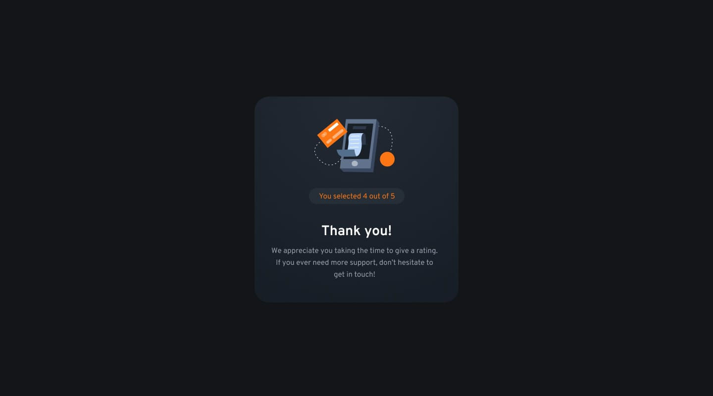

# Interactive Rating Component Solution

Welcome to my solution for the **Interactive Rating Component** challenge on Frontend Mentor! This project focuses on creating a responsive, user-friendly rating system with smooth interactions and feedback.

## Table of Contents

- [Overview](#overview)
  - [The Challenge](#the-challenge)
  - [Screenshot](#screenshot)
  - [Links](#links)
- [My Process](#my-process)
  - [Built With](#built-with)
  - [Design Implementation](#design-implementation)
- [Author](#author)

## Overview

### The Challenge

The goal is to create a rating system where users can:

- See an optimal layout on any device.
- Hover over interactive elements.
- Select a rating and submit it.
- View a “Thank you” card after submission.

### Screenshot

*Check out how the clean and minimal design shines through in action!*

### Links

- Solution URL: [View Code](https://your-solution-url.com)
- Live Site URL: [Live Version](https://your-live-site-url.com)

## My Process

### Built With

- **HTML5**: Semantic structure for accessibility.
- **CSS3**: Responsive layout using Flexbox and Grid.
- **Styled Components**: Dynamic, component-based styling.
- **Mobile-First Workflow**: Designed with mobile users in mind first.

### Design Implementation

The design is minimal yet effective, featuring a fluid layout that adapts across devices. The hover states guide users effortlessly through the rating process, and the "Thank you" card is a seamless conclusion to the interaction.

## Author

- Website - [Add your name here](https://www.your-site.com)
- Frontend Mentor - [@gauravk2203](https://www.frontendmentor.io/profile/gauravk2203)

---